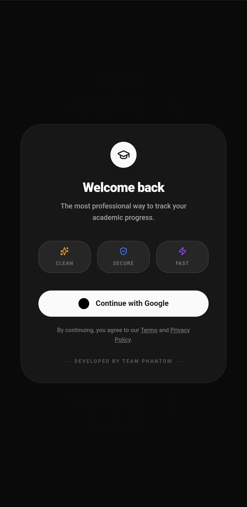
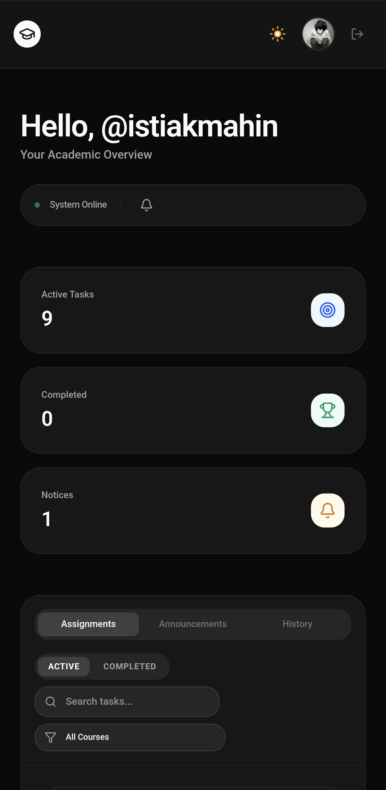
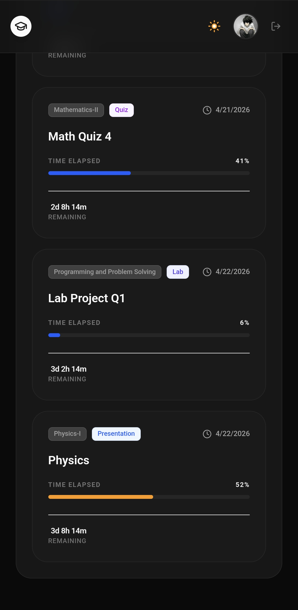
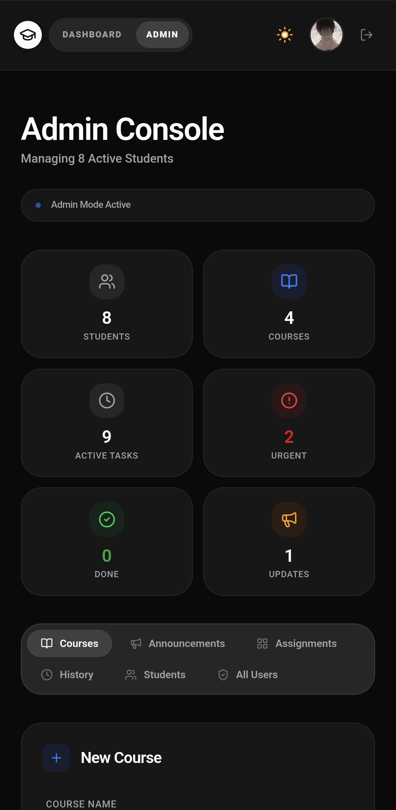
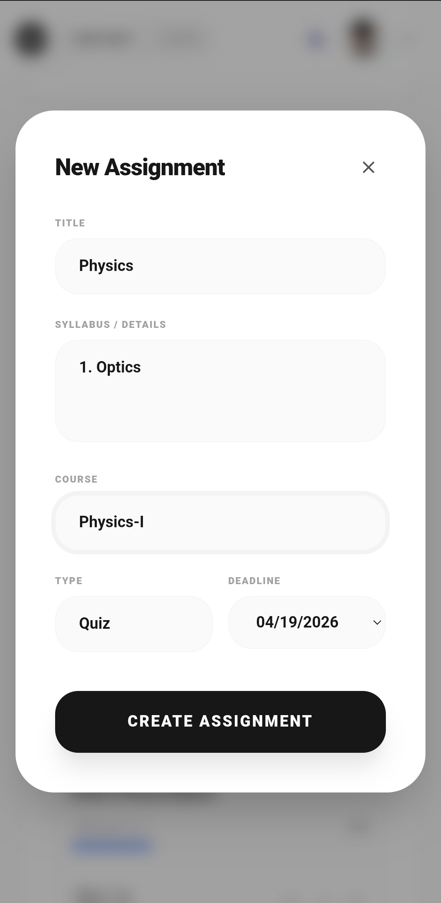

# TaskBuddy 🚀

TaskBuddy is a modern productivity web app designed to help students manage tasks, track deadlines, and stay organized across devices.

---

## ✨ Features

- Add, edit, and delete tasks  
- Deadline and assignment tracking  
- Clean and responsive UI (mobile + desktop)  
- Real-time data sync with Firebase  
- Google Authentication support  
- Admin dashboard  
- Dark/Light mode toggle  
- Persistent data across login/logout  

---

## 🛠 Tech Stack

- React + Vite  
- Firebase (Authentication + Firestore)  
- Tailwind CSS  

---

## 📸 Screenshots







---

## 🚀 Getting Started

Clone the repository:

```bash
git clone https://github.com/istiak-mahin/TaskBuddy.git
cd TaskBuddy
npm install
npm run dev

```
---


## 🔐 Environment Variables

Create a `.env` file and add:

```env
VITE_FIREBASE_API_KEY=your_api_key
VITE_AUTH_DOMAIN=your_auth_domain
VITE_PROJECT_ID=your_project_id
VITE_STORAGE_BUCKET=your_storage_bucket
VITE_MESSAGING_SENDER_ID=your_sender_id
VITE_APP_ID=your_app_id

```
---

## 🌐 Live Demo

https://istiak-mahin.github.io/TaskBuddy/

---

## 📌 Future Improvements
- Email reminders system
- Push notifications
- Advanced analytics

---

## 👨‍💻 Author

Istiak Mahin  
CSE Student | Interested in AI/ML
---
